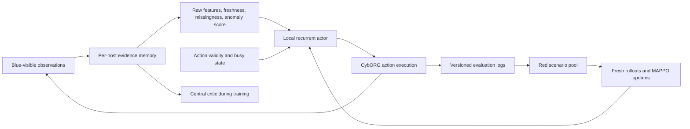

# Blue agent design and implementation plan

Design review: 2026-09-30. Based on the local code, all three supplied papers,
and `../Zeroth_main.pptx` (including the architecture, workflow and timeline images).
This document proposes the next implementation; it does not report a trained agent.

## Recommended contribution

Build a recurrent MAPPO defender that learns when and where to investigate and
when to remediate, using observation history, evidence age, and mission context.
Then adapt it against a growing pool of Red strategies, measuring both improvement
against new attacks and retention against previous attacks.

The testable research question is:

> Does adding observation freshness and uncertainty to a recurrent MAPPO defender,
> followed by retraining on a mixture of old and new attack scenarios, improve
> service-preserving defense under attacker changes compared with a frozen MAPPO
> policy and a strong heuristic?

This is a proposed contribution, not a claim of worldwide novelty. The three
papers are insufficient to establish novelty across the literature. MAPPO,
memory, anomaly features, curriculum learning, hierarchy, graphs, and agent
communication already have precedents. The contribution must be the measured
benefit of the chosen combination and retraining protocol.

## What the papers support

| Source | Relevant evidence | Design consequence |
|---|---|---|
| `00173-KielyM.pdf`, AAAI 2025, Table 2 and team descriptions | Top reported heuristic submissions outperform the reported MARL submission; simple investigation/remediation policies are competitive. Variable topology and attacker changes cause difficulty. | Include a strong heuristic, explicit host validity, and held-out topology/attacker tests. Random is only a smoke-test target. |
| AI Magazine 2025 CAGE4 paper, Table 3 and Team Punch discussion | Substantially overlaps the first paper's competition results. Explains limitations of Remove when Analyse exposes evidence associated with privileged compromise. | Do not count the two papers as independent replications. Make Restore reachable and verify actual cleanup rather than equating action success with cleanup. |
| Hierarchical MARL for Coalition Networks, MILCOM 2024, Sections IV-VI | Proposes CTDE, hierarchy, communication and curricula. Reports difficulty learning with vanilla methods and benefits from phase-wise training; parts of messaging remain ongoing work. | Include mission context and consider curriculum after a working baseline. Do not present the whole proposed hierarchy as experimentally proven superiority. |

The competition numbers use 100 episodes of 500 steps. They cannot be directly
compared with our handoff's single-seed compromise counts at step 200 or a
400-step return. Match the protocol before making numerical comparisons.

Current EPyMARL reference: https://github.com/uoe-agents/epymarl
Checked runner and MultiAgentEnv source on 2026-09-30. Pin a commit when installing.

## Architecture

Five local actors initially match the existing CAGE4 scenario. Parameter sharing
with agent/zone context is the first model; the fifth actor controls three subnets.
Keep each actor's inputs local. The training critic can use the concatenated Blue
views. True Red sessions belong in a separate evaluation channel and must never
become actor features, masks, detector inputs, or online decision explanations.

First compare a conventional masked MAPPO baseline with a recurrent version.
Then add explicit temporal features, changing one component at a time. A shared
per-host encoder with masked pooling/action scoring is a later upgrade for
variable host sets; it does not need a GNN to start.

### Evidence and uncertainty

For each host retain:

- Existing raw file, process, connection and Blue-visible session features.
- Host-present and field-observed flags: unobserved is different from zero.
- Time since last Analyse, last alert, and last remediation.
- Recent event counts over fixed windows; retain event provenance separately
  from snapshots so repeated observations do not create fictitious new events.
- Last completed action, result, verification status and pending duration.
- Anomaly score, score age and score-available flag.

Include agent identity/zone type and mission phase or a documented public schedule.
Use only deployment-available information for host importance and phase context.
Do not interpret a Blue root session as proof of a root-level attacker.

Freshness is an uncertainty proxy, not a calibrated probability of compromise.
Any probability or learned risk score needs separate calibration and evaluation.
The actor should be able to learn that a quiet but uninspected host merits a scan,
and that a stale positive result is weaker evidence than a fresh event.

### Anomaly scoring

The handoff reports Isolation Forest AUC near 0.494 and file-rule AUC 0.875.
Treat those as historical experiment results until reproduced with the repaired
observation pipeline. Do not present the rule detector as an ML model.

Fit IF/LOF on representative benign *runtime* telemetry, with preprocessing fitted
only on training data. Split evaluation by episode/scenario, not random rows from
the same rollout. Evaluate PR-AUC, ROC-AUC and false positives at an explicit
threshold. Compare no score, rule score and ML score under the same RL protocol.
If the learned detector adds no benefit, report that finding rather than forcing
it into the final model. Preserve it as an experiment to address the slide promise.

### Actions and masks

Start with Sleep, Analyse(host), Remove(host), Restore(host). Keep Monitor in a
compatibility baseline if necessary, but explicit Monitor is redundant in this
scenario because it already runs at the end of each step. Add decoys and traffic
control only after a reliable baseline and service-disruption measurements exist.

Separate simulator validity from heuristic preferences. Hard masks should encode
host existence, ownership/session requirements and whether the agent is busy.
An anomaly threshold deciding whether Restore is available is a *policy
restriction*, not just invalid-action handling. Compare such evidence-gated masks
as an explicit ablation; otherwise detector misses can make recovery impossible.

Remove and Restore must both be available where simulator-valid. Penalize their
cost through the task reward, and let the learned actor choose. Do not impose an
unverified privilege label inferred only from unknown files.

## Correctness work before training

Static inspection found the following in `cc4_epymarl_wrapper.py` and
`blue_action_masking.py`. Reproduce them in focused tests and fix both wrappers.

1. **One reset per episode.** The MARL reset calls `cyborg.reset(agent=a)` five
   times. Each call resets the entire simulator, mixing snapshots from different
   worlds. Reset once with the requested seed, then fetch each Blue observation.
   Assigning `self.seed` alone does not apply a reset seed.
2. **Complete host coverage.** The scenario permits 10 users + 6 servers + a router
   per subnet, and agent 4 owns three subnets. `max_hosts=16` with slicing silently
   discards hosts. Derive bounds from the scenario and explicit target eligibility,
   use padding/presence masks, and raise on overflow. Including every router gives
   a conservative 51-host bound for that agent; verify the actual reset contract.
3. **Agent-wide pending action.** Current host-local masks allow a different host
   action while the agent is busy, overwriting `_awaiting` although the controller
   discards the new action. Expose only a waiting action until the original action
   resolves; attribute the result to its original target. Test failures and timeouts.
4. **Consume passive telemetry.** Views are updated only for the pending target
   on success. Merge observations for all visible hosts every tick with appropriate
   event/snapshot semantics. Monitor's local implementation collects process and
   connection events automatically; empty sampled deltas do not establish that
   Analyse is the only evidence source.
5. **Remediation reachability and verification.** Detection always produces
   CONFIRMED_USER, whose mask excludes Restore; CONFIRMED_ROOT is never assigned.
   Both remediation actions currently set CLEAN on success, although Remove can
   return success without eliminating a privileged attacker. Track execution
   success separately from observed verification and evaluation ground truth.
6. **Preserve evidence history.** Issuing Analyse changes the state to REMEDIATING,
   erasing the prior confirmation needed by the two-empty-result rule. Keep action
   progress separate from belief/evidence; missing Files is not proof of no malware.
   Avoid retaining stale Files forever after cleanup or silently deleting uncertainty.
7. **Real EPyMARL integration.** The runner passes tensors and constructor options
   `common_reward` and `reward_scalarisation`; this wrapper does not accept those
   options and accepts only dict/list/tuple actions. Add the lifecycle methods the
   runner needs, normalize action types, and handle episode boundaries explicitly.
   Return one common team reward, not a sum of five identical team rewards.

The handoff's 160 observation dimensions, 800 state dimensions and 50 actions
must not be frozen into a training config before host coverage is corrected.
Use `get_env_info()` to derive dimensions.

Acceptance checks: deterministic reset seed, same-world views, full host coverage,
padding masks, pending-target identity, passive-event ingestion, reachable Restore,
live user/root remediation, correct shared reward, and one complete EPyMARL rollout
and parameter update. Long training starts only after those checks pass.

## Build sequence and exit criteria

| Stage | Deliverable | Exit criterion |
|---|---|---|
| 1 | Correct wrappers, observation memory, regression tests, pinned environment | Acceptance checks above pass; dependency versions and seeds logged. |
| 2 | Sleep, built-in random, masked random, and round-robin Analyse/Restore heuristic | Identical evaluator works across seeds; raw metrics and action traces saved. |
| 3 | EPyMARL masked MAPPO training, checkpoint loader and evaluator | Successful updates, reproducible saved-policy rollout, held-out evaluation. No assumption that it must beat the heuristic. |
| 4 | Recurrent actor plus freshness/missingness/anomaly features | Ablations establish which additions improve return, response time or disruption. |
| 5 | Strategy-pool retraining and retention evaluation | New-attack gains and old-attack retention measured against a frozen policy. |
| 6 | Optional messaging, EWC, decoys/traffic actions | Added only for a measured failure mode, with individual ablations. |

Use the full existing topology first to avoid blocking Blue on environment changes.
If the team chooses a 2-3-zone demo, treat that as a separately versioned scenario
and rerun its baselines. Do not silently rename CAGE zones to DMZ/App/DB.

Start with the native service-aware CAGE reward. Add reward shaping only if a
specific learning failure motivates it, and always evaluate using the original
reward too. Rewarding scans or alerts directly can incentivize unproductive loops.

## What makes the agent different, and how to test it

| Proposed improvement | Expected benefit (hypothesis) | Necessary comparison |
|---|---|---|
| Evidence age + missingness + recurrence | Better sensing priorities under partial observation | Same MAPPO without temporal inputs; recurrent baseline without explicit ages |
| Score as an input, validity-only masks | Recovery remains possible when a detector misses | Evidence-gated policy and no-score policy |
| Mission context | More appropriate disruption/remediation tradeoffs | Same model without mission context |
| Retraining on old/new scenario mixtures | Adaptation with less forgetting | Frozen, new-only fine-tuning, mixture fine-tuning |
| Optional EWC | Further retention if mixture alone is insufficient | Same mixture training with/without EWC |

With PPO/MAPPO, resample old attack *scenarios* and collect fresh on-policy
trajectories. Do not naively replay stale transitions into the PPO update. A logged
action sequence may become invalid under a new topology or defense; store a
replayable Red policy/configuration, simulator version, seeds and preconditions.

The Blue interface to the loop should support loading a policy version, training
against a supplied scenario mixture, saving a new checkpoint, and evaluating it
on fixed suites. Checkpoints must include feature/preprocessing versions, action
mapping, model configuration and training metadata.

## Evaluation

Keep seed 7629 and step-200 counts as regression checks, not the research result.
Recompute those historical baselines once the wrapper is fixed. For final results,
use at least three independent training seeds and a common held-out suite of at
least 30 evaluation seeds per condition if runtime allows. Report variability and
paired comparisons; keep an untouched final suite separate from tuning.

Report native episode return, successful Green work/service disruption, compromised
and root-compromised host counts, compromised host-time, restore frequency, and
unnecessary remediation. Also report detection precision/recall and explicitly
define whether false-positive rate is per host-step, alert, or incident.

For incident timings define first compromise, first Blue detection and verified
clearance. Report detection-to-clearance and compromise-to-clearance separately.
Count unresolved/undetected incidents as censored and report their proportions;
do not average only easy resolved incidents. A transient removal followed by
reinfection is not permanent containment.

Test held-out topologies, changed phishing pressure and available alternative Red
policies. Artificial telemetry dropout is a sensor-robustness experiment, not proof
of robustness to a real stealth attacker. Publish ablations even if they are null.

Log JSONL per step: episode/scenario/seed, policy version, step, agent, evidence
summary and ages, intended and executed action, target, pending/result status,
mask/fallback reason, native reward and timing. Keep privileged evaluation labels
in a separate namespace or file. An explanation should cite observed evidence and
action status; it is not a guarantee that a neural policy's rationale is known.

## Alignment with the zeroth review

The slides' strongest feasible claim is the closed-loop improvement curve, shown
as the core research novelty in slide 12. The plan preserves MAPPO/CTDE, anomaly
features, versioned policies and retraining, while making each measurable.

| Slide commitment | Current implementation boundary / next-review wording |
|---|---|
| Docker, eBPF, JuiceShop/DVWA, container isolation | Current prototype is CybORG simulation. Real telemetry and action adapters are separate Environment integration work; a Dockerized simulator alone is not a real container cyber-range. |
| Sub-100ms policy action | Measure actor inference p50/p95 on specified hardware, separately from simulator stepping and external action execution. This is a target until benchmarked. |
| MTTR below 5 seconds / sub-second containment | Report simulation steps in CybORG. Measure seconds only on an actual execution environment with an explicit timing protocol. |
| More than 90% false-positive reduction | A hypothesis requiring a defined baseline, threshold, dataset and denominator; not an existing result. |
| Zero-day resilience and payload mutation | Demonstrate held-out simulator strategies first. This does not establish real exploit or zero-day generalization. |
| Bandwidth-limited coordination | CTDE alone does not implement messaging. Until communication is added, actors execute locally with no peer messages. |
| Strategy pool + EWC | Start with frozen vs fine-tuned vs mixed-scenario policies. Add EWC if forgetting remains measurable. |
| MITRE audit and SIEM export | Emit structured evidence/action logs now; mappings, auditor and SIEM integration are separate deliverables. |

Slide 5-6 bibliographic entries were not validated in this review. Verify titles,
authors, venues and DOIs before reusing them; the three supplied full papers give
a firmer foundation for the Blue section. Update the broad claim that heuristics
are inferior: the supplied CAGE4 evaluations specifically found strong heuristics.

No agent implementation or training was changed during this design review.
Extracted source text and diagram assets are under `../research-notes/`.
